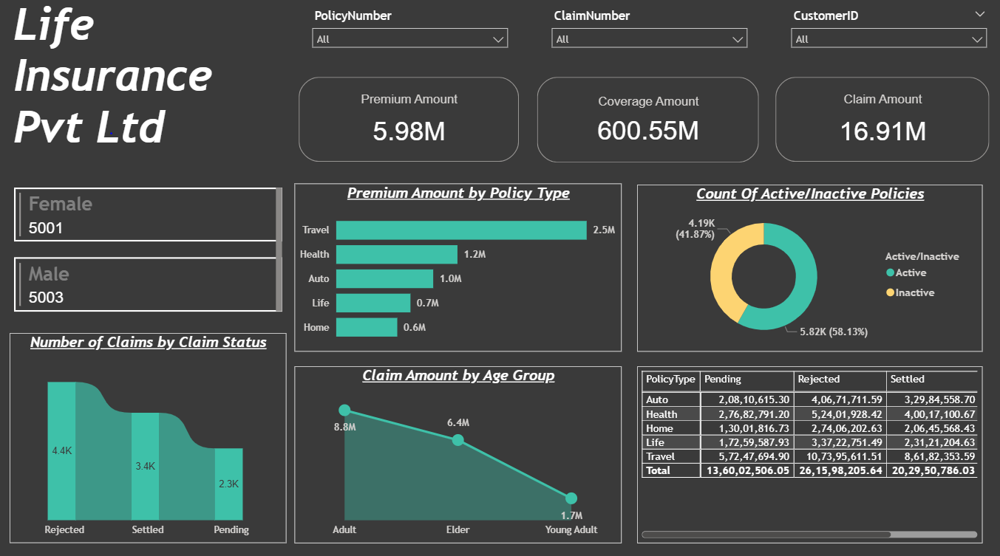

# 🧾 Life Insurance Business Performance Dashboard

---

**📊 Project Overview**

This project presents an interactive Power BI dashboard designed for Life Insurance Pvt. Ltd. to analyze key performance metrics related to insurance policies, claims, and customer demographics.

The goal is to enable management to make data-driven decisions by visualizing premium trends, claim behaviors, and policy activity through a unified and interactive Power BI solution.

---

**🏢 Business Problem**

**Background:**
Life Insurance Pvt. Ltd. offers multiple insurance products such as Life, Health, Travel, Auto, and Home policies. The company needed a centralized view of its core business metrics — including revenue from premiums, claim settlements, policy activity, and customer demographics.

**Problem Statement:**
Due to data spread across multiple systems, management lacked visibility into how different policy types and claim statuses impacted overall business performance.
This limited their ability to:

Identify high-value policy types

Track claim settlement ratios and pending claims

Evaluate customer engagement through active/inactive policies

Optimize marketing and policy design for target age groups

**Objective:**

To develop a Power BI dashboard that connects directly to the company’s SQL Server database, consolidating all relevant information into a single, interactive view for better business insight and strategic decision-making.

---

**❓ Key Business Questions**

What is the total premium, coverage, and claim amount collected?

Which policy types contribute the most to premium revenue?

What percentage of policies are active vs inactive?

How are claims distributed among settled, pending, and rejected statuses?

Which age groups contribute most to claim amounts?

---

**🧮 Key Performance Indicators (KPIs)**

| KPI                                   | Description                                  |
| ------------------------------------- | -------------------------------------------- |
| **Total Premium Amount**              | Total premiums collected from all policies   |
| **Total Coverage Amount**             | Total insured amount covered                 |
| **Total Claim Amount**                | Total claims raised by customers             |
| **Claim Settlement Ratio**            | Percentage of settled claims vs total claims |
| **Policy Activation Rate**            | Ratio of active policies to total policies   |
| **Average Claim Amount by Age Group** | Claim trends segmented by age categories     |
| **Gender Distribution**               | Distribution of policyholders by gender      |

---

**🛠️ Tools & Technologies Used**

Power BI – For dashboard creation and data visualization

Microsoft SQL Server – Data source connection (via Import Mode)

Power Query – Data cleaning and transformation

DAX (Data Analysis Expressions) – Custom measures and KPIs

CSV – Supplementary reference data

---
**Project Folder Structure**

    data/
    ├── Insurance Project.pbix
    ├── Insurance.PNG (Clip of the Dashboard)
    ├── InsuranceData.csv
    
---

**📈 Dashboard Overview**

**1. Summary KPIs**

Premium Amount: 5.98M

Coverage Amount: 600.55M

Claim Amount: 16.91M

**2. Policy Performance**

Highest premiums from Travel Insurance (2.5M)

Lowest from Home Insurance (0.6M)

**3. Claim Insights**

Rejected Claims: 4.4K

Settled Claims: 3.4K

Pending Claims: 2.3K

**4. Policy Activity**

Active: 58.13%

Inactive: 41.87%

**5. Age Group Analysis**

Adults: Highest claim amount (8.8M)

Young Adults: Lowest claim amount (1.7M)

💡 Additional interactivity such as cross-filtering and drill-through was implemented to allow users to explore customer and policy-level details for deeper insights.

---

**🧩 Insights & Recommendations**

Travel Insurance generates the highest premium — cross-selling with Life or Health policies can enhance revenue.

Claim rejection rate indicates a need for better claim documentation and verification workflows.

Adults have the highest claim ratio — adjust policy pricing or coverage accordingly.

Inactive policy rate (41.87%) suggests potential retention issues — consider targeted renewal campaigns.

---

**📁 Dataset Description**

| Column Name      | Description                                          |
| ---------------- | ---------------------------------------------------- |
| `PolicyNumber`   | Unique policy identifier                             |
| `ClaimNumber`    | Unique claim identifier                              |
| `CustomerID`     | Unique customer ID                                   |
| `PolicyType`     | Type of insurance (Life, Health, Travel, Auto, Home) |
| `PremiumAmount`  | Amount paid for policy premium                       |
| `CoverageAmount` | Total coverage provided under the policy             |
| `ClaimAmount`    | Amount claimed by customer                           |
| `Gender`         | Gender of policyholder                               |
| `AgeGroup`       | Age category (Young Adult, Adult, Elder)             |
| `ClaimStatus`    | Claim outcome (Pending, Settled, Rejected)           |
| `PolicyStatus`   | Indicates whether policy is Active or Inactive       |

---

**🧠 Learnings**

Strengthened understanding of insurance analytics and KPI measurement.

Built an end-to-end BI pipeline — from SQL Server data connection (Import Mode) to Power BI visualization.

Applied DAX measures for calculating dynamic metrics.

Implemented drill-through and cross-filtering for advanced interactivity.

---

**📸 Dashboard Preview**

---

**🚀 How to Use**

Download the .pbix file from this repository.

Open in Microsoft Power BI Desktop.

Interact with filters and visuals to explore data.

Use drill-through to view details for selected customers or policies.

---

**💬 Author**

👩‍💻 Author Nisha2611 Data Analyst | Passionate about SQL & Data Cleaning

🔗 LinkedIn 🔗 GitHub

💬 Feedback

Have suggestions? Open an issue or drop a ⭐ if you found it helpful!
]
🌐 [LinkedIn / Portfolio Link]
